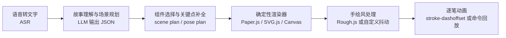

# LLM 生成儿童线稿动画的最佳媒介路径调研报告

## 执行摘要

两份附件把问题界定得非常清楚：你要的不是“一张 AI 画”，而是“父母与 4 岁孩子口述一句故事后，系统在 8 秒内产出一幅黑白手绘线稿，并且线条要能像铅笔在纸上那样一笔一笔画出来”。第一份附件总结了你在“LLM 直接写 SVG”方向上的真实实测：DeepSeek V3 够快但画面过于简陋，DeepSeek Flash 几何崩坏，豆包相关模型延迟过高；第二份附件则进一步把问题升级为“不要把 SVG 当成唯一中间态，只要最终能保留逐笔描边动画，Canvas、指令流、程序化绘图、图像转线稿等路径都值得研究”。这说明核心矛盾已经从“怎么写更好的 SVG”转向“怎样把 LLM 放在更擅长的位置上”。fileciteturn0file0 fileciteturn0file1

综合外部证据后，最优解不是继续逼 LLM 直接输出几何细节，而是采用**“LLM 当美术指导 + 确定性渲染器当画师”**的混合方案：LLM 只输出结构化 scene plan 或 draw plan；渲染层用 Paper.js 这类矢量脚本库负责路径生成、平滑、简化和导出 SVG，再叠加 Rough.js 的手绘抖动感，最终用原生 SVG 的 `stroke-dasharray` / `stroke-dashoffset` 或 Canvas 指令回放实现“逐笔画出”的动画。这个方向同时满足你的四个关键约束：质量、延迟、成本和动画可行性。OpenAI 的 Structured Outputs 明确支持按 JSON Schema 约束输出，并且官方文档明确建议当复杂任务容易出错时，应提供示例或拆成更简单的子任务；Paper.js 官方提供路径平滑、简化与 SVG 导入导出；Rough.js 官方支持在 SVG 和 Canvas 上以手绘风格绘制 primitives 和 paths；MDN 明确说明 `stroke-dasharray` / `stroke-dashoffset` 可直接作用于 `path`、`circle`、`line` 等元素。citeturn6search1turn6search0turn19academia25turn16search0turn15search0turn15search1turn1search0turn7search0turn7search1

第二可行路线是**“图像生成 + 线稿提取 + 向量化”**，但它更适合作为偶发“封面页/高潮页”的增强路线，而不适合做“每一句话都实时生成”的主路径。原因很直接：当前主流图像 API 官方输出仍是 PNG/JPEG/WebP 这类栅格图像，而不是带笔画顺序的矢量图；后续还需要做边缘提取、风格化和向量化；即便 VTracer、Potrace、AutoTrace 这类工具很成熟，AutoTrace 虽支持 centerline tracing，但整条链路对“逐笔顺序”“单线中心轨迹”“稳定 <8 秒”仍不够友好。citeturn0search0turn0search4turn2search2turn17search2turn0search2turn13view0turn4search2

研究型路线例如 sketch-rnn、DeepSVG、VectorFusion、LiveSVG、VAnim，证明了“向量草图”与“矢量动画”在学术上是可行的，但它们普遍依赖可训练模型、可微分渲染器、长时优化或视频拟合，不符合你“不要自建模型、不要本地 GPU、一天内可落地”的工程约束。换句话说，这些方向值得知晓，但不值得现在押注。citeturn18academia31turn18search4turn9academia28turn8academia39turn9academia26turn9academia29

## 附件关键信息

两份附件共同给出了一个很稳定的产品约束集合：目标用户是父母与 4 岁孩子；视觉风格是黑白线稿、手绘感、非彩色；动画必须保留“铅笔自己画出来”的逐笔描边感；单幅画延迟要低于 8 秒；不接受自建模型或本地 GPU；画面复杂度面向 3–4 岁儿童认知水平，只需恐龙、月亮、花朵、蝴蝶、小猫等基础对象即可。第一份附件还给出了此前系统 prompt、SVG 元素预算、禁止使用的标签和当前模型实测；第二份附件则明确把探索边界扩展到 A–H 八种路线。fileciteturn0file0 fileciteturn0file1

从问题诊断看，附件已经隐含了三个关键判断。第一，**直接让 LLM 写最终几何**会让模型一边做故事理解，一边做构图，一边做路径几何，一边做格式约束，任务负载过重，因此结果容易退化成“可解析但不好看”的符号画。第二，**逐笔动画的本质不是 SVG 本身，而是可排序、可回放的描边序列**；也就是说，最终媒介可以是 SVG、Canvas 甚至自定义 draw-command，只要能回放笔画顺序即可。第三，**你真正需要的是“语义结构正确 + 风格稳定 + 路径可动画”，而不是“模型自由发挥几何坐标”**。这些判断与附件中的失败案例——例如“月亮上的猫退化为大圆+小椭圆+两个三角”——高度一致。fileciteturn0file0 fileciteturn0file1

附件中仍有几项“未指定”的关键工程指标，建议在后续实现前补齐，因为它们会直接影响方案优先级判断。

| 未指定项 | 当前状态 | 为什么关键 | 建议补充方式 |
|---|---|---|---|
| 儿童可识别度指标 | 未指定 | 你现在用“像不像绘本”“孩子认不认得出”做主观判断，但没有统一验收口径，难以比较 A–H 路线。fileciteturn0file0 | 设定 5 岁以下成人代测或家长主观评分，记录“主角识别率/动作识别率/喜欢程度”。 |
| 笔画顺序表示 | 未指定 | 逐笔动画依赖 stroke order；如果没有统一的笔画顺序中间表示，SVG、Canvas、向量化结果都很难稳定回放。 | 定义 `strokes[]` 或 `commands[]` 中间层。 |
| 每帧成本上限 | 未指定 | 你给了“纯 API”但没给价格带；图像生成路线与结构化 LLM 路线的成本差异很大。 | 先设目标，例如每帧 < 人民币 0.1 或 < 美元 0.02。 |
| 高质量页是否允许慢一些 | 未指定 | 如果封面页或高潮页可放宽到 10–15 秒，图像生成路线的价值会上升。 | 把“普通页”和“高潮页”拆成双 SLA。 |
| 前端是否允许浏览器本地渲染 | 未指定 | A/D/E/F 方案的优势很大程度来自本地 deterministic rendering；如果前端可做，后端压力会显著下降。 | 明确“可浏览器渲染/必须服务端渲染”。 |

## 外部证据

外部资料基本支持一个结论：**当任务同时包含叙事理解、格式约束、层级布局和几何生成时，把任务拆开比单轮端到端更稳**。OpenAI 的 Structured Outputs 文档明确说明，JSON Schema 可以强约束格式；同时官方也明确写到，如果模型仍会在值内容上犯错，建议提供示例或把任务拆成更简单的子任务。与此一致，Decomposed Prompting、Successive Prompting 等研究也都表明：复杂任务拆成可独立优化的子任务后，整体表现通常优于把所有目标揉在一个 prompt 里。就你的场景而言，这直接支持“故事理解”和“画面规划/渲染”分离，也支持把“场景语义”和“线条生成”分离。citeturn6search0turn6search1turn19academia25turn19academia28

在渲染层面，现成的开源工具链已经足够成熟。Paper.js 是以 Bézier 曲线和 scene graph 为核心的矢量脚本框架，提供 `smooth()`、`simplify()`、`flatten()` 等路径处理能力，并且原生支持 `exportSVG()`；这意味着你完全可以让 LLM 只输出“身体轮廓点、头部圆心、尾巴起止点、腿部骨架”等结构参数，再由 Paper.js 生成平滑路径并导出 SVG。Rough.js 则可以在 Canvas 和 SVG 上把线、曲线、圆、多边形及 SVG path 渲染成“sketchy / hand-drawn”风格，从而显著减轻模板感。SVG.js 和原生 SVG `<animate>` 进一步说明，逐笔动画不必依赖复杂视频模型，浏览器栈本身就可以处理动画时间线。citeturn1search3turn15search0turn15search1turn16search0turn16search1turn1search0turn9search3turn9search0turn7search2

“图像生成 + 线稿提取”路线也有成熟工具，但其痛点同样明确。OpenAI 的图像生成官方文档说明，当前图像 API 返回的是 base64 编码的图像数据，默认格式是 PNG，也可请求 JPEG 或 WebP；并没有“输出可回放笔画序列”这一能力。后处理侧，OpenCV 官方文档中的 Canny 是经典多阶段边缘检测；XDoG 则是在学术上更偏“风格化线条”的方法；矢量化侧，Potrace 是经典 bitmap tracing 算法，VTracer 可以把 PNG/JPG 转成 SVG，且 README 明确指出它相较 Potrace 额外内建了适合彩色和高分辨率输入的图像处理流水线；AutoTrace 更进一步支持 outline tracing 和 centerline tracing，而 centerline tracing 对“像笔真的走过中线那样画出来”尤其重要。换句话说，这条链路在工具层面是成立的，但它本质上是“图像后验分析”，而不是“原生笔画生成”。citeturn0search0turn0search4turn2search2turn17search2turn13view0turn0search2turn4search2

组件化与参数化路线也有现实启发。Open Peeps 官方网站展示的是一个典型的 hand-drawn modular illustration library：身体、表情、姿势、服饰等可像积木一样混搭，这与附件里的“模板式拼贴”思路高度相似。它不是 LLM 项目，但它证明了“矢量积木 + 参数组合”可以在保持手绘感的同时，大幅提升可控性和组合空间。对你的目标对象集合——恐龙、月亮、花朵、蝴蝶、小猫——这种方法甚至比人物插画更容易做，因为对象种类更少、姿态更有限。citeturn20search0

至于研究型路线，证据非常充分，但也同样说明它们更适合“知道有这条路”，不适合“今天就上”。sketch-rnn 和 Google 的演示说明，笔画序列生成完全可行；DeepSVG 证明了层级式 SVG 表示学习和插值可做；VectorFusion 通过可微分矢量渲染器把文本条件下的 raster prior 蒸馏成 SVG；而 2025–2026 年的 Vector Prism、LiveSVG、VAnim 则进一步表明，SVG 动画真正难的是**语义分组、结构保持和非刚体形变**。这几篇工作实际上从侧面解释了为什么“让普通 LLM 直接写一大坨 SVG”会显得不稳：因为语义层和低层路径层之间本来就缺了一层。citeturn18academia31turn18search4turn9academia28turn8academia39turn9academia25turn9academia26turn9academia29

## 比较分析

下面的矩阵按你在附件中提出的 A–H 方案逐一比较。表中的“延迟/成本”判断基于附件实测、官方文档和工程推断综合给出；其中只要涉及当前 API 能力、库能力或论文方法，均附上对应来源。fileciteturn0file1

| 方案 | 工作原理 | 是否有人做过类似的 | 延迟/成本判断 | 动画适配 | 对 4 岁儿童场景是否过度设计 | 结论 |
|---|---|---|---|---|---|---|
| 方案 A | LLM 只输出场景 JSON，确定性 renderer 负责把“头/身体/尾巴/腿/位置/动作”转成线条。 | Structured Outputs 支持 JSON Schema；Paper.js 支持路径生成、平滑与 SVG 导出；Rough.js 支持手绘风。citeturn6search1turn16search0turn1search0 | 很可能满足 <8 秒，因为昂贵阶段只剩一次结构化 LLM 调用，渲染在本地或服务端 JS 完成；成本显著低于图像生成。此处是基于官方 Structured Outputs 与本地渲染库能力的工程推断。citeturn6search1turn19search2turn16search0 | 极强；天然可定义 stroke order。citeturn7search0turn7search1 | 不过度，反而最贴合简单对象。 | **最推荐** |
| 方案 B | 先生成栅格图，再线稿提取、风格化、向量化。 | OpenAI 图像 API、OpenCV Canny、XDoG、Potrace、VTracer、AutoTrace 都是现成证据。citeturn0search0turn0search4turn2search2turn17search2turn13view0turn0search2turn4search2 | 质量可高，但 8 秒 SLA 不稳；且官方图像输出是 raster，不含笔画顺序。向量化不一定是瓶颈，但图像生成本身常是瓶颈。citeturn0search0turn0search4turn0search2 | 中等；能做“描边出现”，但难恢复“真实笔顺”。AutoTrace 的 centerline tracing 能部分改善。citeturn4search2turn7search0 | 对简单儿童图有些“以大炮打蚊子”，除非只用于少数高质量页。 | **适合作为增强/备选** |
| 方案 C | LLM 生成 p5.js / Processing / JS 绘图代码，运行后得到画面。 | p5.js 是成熟 creative coding 平台；GenP5 研究讨论了算法艺术与 AI 艺术桥接；社区已有自然语言构建 p5.js 原型。citeturn12search0turn12search1turn10academia40turn12reddit38 | 比直接写 SVG 更友好，因为代码分层更自然；但“自由代码空间”仍大，稳定性弱于 JSON+renderer。citeturn12search0turn1search2 | 强；Canvas 可逐步执行，或再导出 SVG。citeturn1search2turn16search0 | 中度过度设计；做 demo 容易，做稳定产品偏重。 | **可行，但不如 A 稳** |
| 方案 D | 预制 SVG 组件，LLM 负责选件、排布、动作和变体。 | Open Peeps 证明了“手绘矢量组件库 + 混搭”是成熟设计模式。citeturn20search0 | 延迟和成本都非常好；组件命中后几乎只需一次规划调用。 | 极强；每个组件可预先定义 stroke order。 | 不过度；尤其适合恐龙、猫、月亮、花朵这类有限类目。 | **与 A 结合极佳** |
| 方案 E | LLM 输出骨架点/关键点，算法用 Bézier 插值、平滑和简化生成最终路径。 | sketch-rnn 证明“笔画序列”表示可行；Paper.js 可做 smooth / simplify / flatten。citeturn18academia31turn18search4turn15search0turn15search1 | 很可能满足 SLA，因为主耗时仍是 LLM 规划。 | 很强；骨架点天然就是笔顺或路径控制点的前身。 | 不过度，适合四肢、尾巴、翅膀、花茎等细长部件。 | **推荐作为 A 的内部技术** |
| 方案 F | LLM 输出 Logo / Turtle 风格绘图指令，由浏览器按步骤执行。 | 这是经典 turtle graphics 范式；现代 JS 也有轻量 turtle 库，但未见成熟“LLM + turtle 面向儿童线稿”的通用产品案例。现有浏览器动画能力足够。citeturn11search0turn11search1turn7search0turn7search2 | 延迟和成本很好；输出空间比 SVG 大幅收缩。 | **最天然**，因为指令本身就是动画脚本。 | 不过度，但表达力会受 DSL 设计限制。 | **很值得做成受限 IR** |
| 方案 G | 用同一家多模态模型同时做 ASR、故事理解和出图。 | OpenAI 官方已有语音转文字与图像生成 API；但图像输出仍是 raster，不是带笔顺的矢量。citeturn5search0turn14search1turn0search0turn0search4 | ASR 可快，出图未必稳；且“单模型一步完成”并不自动得到可描边格式。 | 弱；核心缺失是 vector strokes order。 | 对当前需求偏错位。 | **不推荐做主路径** |
| 方案 H | 直接使用研究型文本到矢量或矢量动画方法。 | DeepSVG、VectorFusion、LiveSVG、VAnim 都是代表。citeturn9academia28turn8academia39turn9academia26turn9academia29 | 工程重、依赖多、难以纯 API 即插即用。 | 理论上强，现实接入重。 | 明显过度设计。 | **知道即可，先不做** |

如果只按四个核心维度——**质量、延迟、成本、动画可行性**——给出综合排序，我的判断是：**A 与 D 的融合方案最好，E 与 F 作为内部实现细节补强；B 是优质备选但不应成为默认实时路径；C 可以做实验但不宜直接做产品内核运行时；G 与 H 暂不建议作为主路。** 这个排序与附件中的既有发现也高度一致：你已经用真实试验验证了“直接把几何写死在 prompt 里”会迅速撞墙，而外部文献又进一步证明，中间层语义结构和语义分组恰恰是 SVG / 动画系统最欠缺、也最关键的一环。fileciteturn0file0 fileciteturn0file1 citeturn9academia25turn9academia29

再看来源可靠性，当前证据链也足够清晰：你自己的附件最能说明本项目局部真实性能；官方文档最能说明 API 与库的真实能力边界；论文最能说明长期可行性；GitHub README 与社区 demo 只适合做“有人这么做过”的补充，而不适合做主决策依据。这个可靠性排序也意味着，最终结论应以**附件实测 + 官方能力边界 + 工程复杂度**三者的交集来定，而不是以学术最佳视觉质量来定。fileciteturn0file0 fileciteturn0file1 citeturn6search1turn16search0turn18academia31turn8academia39

| 来源类型 | 本报告中的用途 | 可信度 | 局限 |
|---|---|---|---|
| 你的附件实测 | 真实约束、真实失败模式、真实延迟经验 | 很高 | 只覆盖你试过的模型和 prompt。fileciteturn0file0 fileciteturn0file1 |
| 官方 API / 官方文档 | 判断结构化输出、图像输出格式、语音能力、动画能力边界 | 很高 | 很少给“你这个产品一定能在 8 秒内完成”的承诺。citeturn6search1turn0search0turn5search0turn7search0 |
| 论文 / 项目主页 | 判断某条路线是否长期成立 | 高 | 通常不等于“今天能商用接入”。citeturn18academia31turn9academia28turn8academia39turn9academia26 |
| GitHub / 组件库网站 | 判断库功能、设计模式和可借鉴案例 | 中高 | 对延迟、质量和稳定性缺少统一评测。citeturn0search2turn20search0 |
| 社区 demo / 论坛 | 证明“有人做过类似东西” | 中 | 只能做辅证，不能做核心决策依据。citeturn12reddit38 |

## 结论与建议

最适合你当前项目的主路线，是把 A、D、E、F 组合成一个统一架构：**LLM 输出 scene plan / draw plan，组件库与参数化骨架负责造型，渲染器负责曲线和手绘风，动画层负责逐笔回放。** 这条路线的关键不是“是不是 SVG”，而是先建立一个受控的中间表示。这个中间表示可以长成下面这样：角色类型、布局框、层级、动作、朝向、组件清单、关键点、每一笔的绘制顺序。这样一来，LLM 负责的是它擅长的“语义、选择、排列、摘要”，而不是它不擅长的“最终精确几何”。OpenAI 官方对 Structured Outputs 的描述，加上 Vector Prism 对“语义分组”的强调，共同说明这是更稳的系统分工；Paper.js 与 Rough.js 则让这个分工可以在现成开源库上落地。citeturn6search1turn6search0turn9academia25turn16search0turn1search0

上图对应的工程现实也很明确：如果你希望**最小改动**，可以继续使用你已经实测过、且命中 prompt cache 时很快的 DeepSeek V3 作为“场景规划器”，但不要再让它直接输出最终 SVG 几何。附件里已经说明它在这个角色上快、在“最终画师”角色上弱。若你希望**单供应商整合栈**，OpenAI 目前在语音转文字、结构化输出、图像生成上官方能力更完整：语音转文字有 `gpt-4o-mini-transcribe` / `gpt-4o-transcribe`，结构化输出有 JSON Schema，图像生成也可用于备选封面页；但要注意，OpenAI 图像输出依然是 raster，因此即便切换到 OpenAI，也不意味着“统一模型一步产出可描边笔画格式”。换句话说，**要不要换供应商，取决于你是想改善“规划与语音栈”，还是想继续赌“一个模型直接画完”**；前者值得换，后者不值得赌。fileciteturn0file0 citeturn5search0turn14search1turn6search1turn0search0turn0search4

对“图像生成 + 线稿提取”这条路线，我的明确建议是：**只把它作为高质量页的旁路，不要作为每句都走的主路径。** 它的上限更高，但对你这个产品，真正稀缺的不是“偶尔很惊艳”，而是“每一页都稳定、快、可动画、便宜”。而且，一旦进入 raster，再回到可控的单线笔顺，整条链路就会不断跟“边缘噪声、双线轮廓、路径碎片化、笔顺丢失”作斗争。AutoTrace 的 centerline tracing 确实能缓解一部分问题，但并不能把图像模型的栅格结果直接还原成你想要的“讲故事式笔顺”。citeturn0search0turn0search4turn2search2turn17search2turn4search2

回到你特别追问的那一点：**上一版关于 SVG 生成的三个发现——scene plan 分层、本地编译器、构图原型 few-shot——在这个新问题下仍然成立，而且反而更重要。**  
第一，**scene plan 分层**不再只是“帮助 SVG 更像样”，而是整个系统的主干，适用于 A、D、E、F，也能作为 B 路线的 prompt 前置。第二，**本地编译器**的价值更高了：以前它只是“把 LLM 产出的 element array 拼成 SVG”，现在它应该升级成“把 LLM 产出的 scene plan 编译成 SVG/Canvas/命令流”的真正 renderer。第三，**构图原型 few-shot**依然有用，但它最适合约束“布局模式”和“镜头语言”，而不是直接监督最终笔画几何；也就是说，few-shot 应该喂给 planner 层，而不是喂给最终 path 层。OpenAI 官方 prompt 指南和分解式 prompting 研究，都支持这种“把复杂任务拆成可独立 few-shot 的阶段”的做法。fileciteturn0file0 fileciteturn0file1 citeturn19search2turn19search3turn19academia25turn19academia28

## 行动计划

考虑到你强调“没有大团队，也没有 GPU 集群”，以下行动计划以**一天内能落地的最短路径**为目标，不包含训练、微调或复杂基础设施改造。

| 时间窗 | 动作 | 具体产物 | 验收标准 |
|---|---|---|---|
| 今天上午 | 把单一大 prompt 拆成两层 | 一层 `story planner`，一层 `drawing planner`；第二层输出严格 JSON Schema，而不是 SVG 字符串 blob。citeturn6search1turn19academia25 | 输出稳定命中 schema，失败率明显低于“一步到位”。 |
| 今天上午 | 定义最小中间表示 | 例如：`scene`, `layers`, `actors`, `props`, `posePoints`, `strokesOrder`, `stylePreset`。 | 任意一句故事都能落到该 schema 上，不需要自由文本补洞。 |
| 今天中午 | 搭一个小而好看的组件库 | 只做 20–30 个基础部件：恐龙头/身体/尾巴/腿/背鳍，小猫头/躯干/尾巴，月亮、星星、花朵、蝴蝶、地面、云。设计思路参考 Open Peeps 的 mix-and-match。citeturn20search0 | 用组件库手工拼出 10 张图，不靠 LLM 也已经“够像绘本”。 |
| 今天下午 | 用 Paper.js 或 SVG.js 写确定性 renderer | 输入 scene plan，输出有序 SVG 路径；在肢体、尾巴、花茎等处加入 `smooth()` / `simplify()` 逻辑。citeturn16search0turn15search0turn15search1turn9search0 | 同一个 scene plan 多次渲染结果稳定，无几何漂移。 |
| 今天下午 | 加入手绘风与动画层 | 用 Rough.js 或轻量扰动算法给轮廓加抖动；路径以固定顺序逐笔播放。citeturn1search0turn7search0turn7search1 | 视觉上明显比“几何模板拼装”更像手绘；每笔可见。 |
| 今天傍晚 | 只做一轮小评测 | 选 20 个儿童句子，记录总延迟、识别率、失败率、喜欢度。 | 若平均延迟 <8 秒、主角识别率高、失败率可控，就冻结主路径。 |

如果你需要一个更具体的落地选择，我会这样定：**主路径**采用“DeepSeek V3 或其他便宜快速 LLM 做 scene plan + 本地/浏览器确定性渲染器 + SVG/Canvas 逐笔动画”；**增强路径**仅在少数高价值画面上调用图像生成，再做 XDoG / Canny + centerline tracing 尝试；**研究观察路径**只保留对 sketch-rnn / DeepSVG / VectorFusion / LiveSVG 的信息关注，不进入当前版本开发。这个取舍最符合你在附件里给出的现实边界，也最符合外部证据显示的技术成熟度分布。fileciteturn0file0 fileciteturn0file1 citeturn18academia31turn9academia28turn8academia39turn9academia26