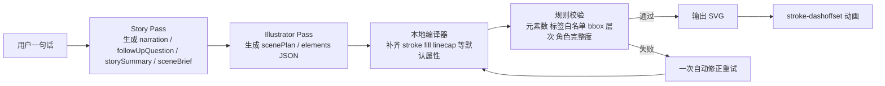

# 儿童线稿 SVG 绘本生成方案深度调研报告

## 执行摘要

这份附件本质上是一份**产品需求与工程实验备忘录**：目标是在父母与孩子口述故事的过程中，实时生成黑白线稿 SVG，并通过 `stroke-dashoffset` 做“铅笔自绘”动画；当前约束包括固定画布 `400×300`、纯描边、元素数量约束、禁止填色与脚本、角色必须足够幼儿可辨认；当前实现则把“旁白、追问、故事总结、插画 SVG”四个任务揉进同一个提示词里，配合 3 个 few-shot SVG 示例，让 DeepSeek 的 OpenAI 兼容接口直接返回 JSON。附件清楚描述了目标与限制，但其“速度”和“画面质量”结论主要来自项目内实测观察，而不是带日志、指标和对照组的系统评测。fileciteturn0file0

核心结论很明确：**你现在最该改的不是“把提示词再写长一点”，而是把单次大杂烩调用拆成两个窄任务调用**。原因不是“多阶段一定神奇”，而是你当前一个请求里同时要求压缩用户原话、生成追问、维护故事总结、再去画图，任务目标彼此竞争；而官方提示工程文档普遍建议把身份、规则、示例、上下文清晰分层，few-shot 示例尽量集中在单一输出模式；同时，最近的 SVG 研究也表明，LLM 在**低层 SVG 代码、复杂结构、渲染顺序、局部画布状态推理**上仍然明显吃力，尤其在直接“盲画”时更容易产生过度简化、遮挡关系混乱与几何失真。fileciteturn0file0 citeturn21view3turn15academia17turn13view0turn12view0

第二个关键结论是：**few-shot 数量不是越多越好，质量、覆盖面与格式，比“到底是 3 个还是 8 个”更重要**。OpenAI 和 Gemini 的官方文档都强调 few-shot 要“多样、明确、贴近目标输出”；相关论文则显示，in-context learning 的表现对示例选择极其敏感，好的示例集与坏的示例集可能拉开明显差距，而“例子的格式与输入分布”往往比标签本身更关键。对你这个任务，问题不是“只有 3 个一定不够”，而是**3 个例子覆盖的构图原型太窄，且都在教模型输出‘最终 SVG 字符串 blob’而不是‘先做结构规划再落坐标’**。citeturn21view3turn2search3turn5academia49turn5academia48

第三个关键结论是：**不要继续把 SVG 当成一个不可解释的大字符串来让模型一次性吐出来**。更稳的工程做法，是让模型先输出**分层的场景计划或元素数组**，例如 `far/mid/near` 三层、每个元素的 `role`、`bbox`、`primitive type`、`points/path`、`strokeWidth`、`drawOrder`，再由你自己的小型编译器把这些结构化对象拼成 SVG。OpenAI 与 Gemini 的官方 structured outputs 都支持 JSON Schema 约束；而 DeepSeek 当前公开文档里的 `json_object` 只保证“合法 JSON”，**不保证严格符合你想要的 schema**，且官方明确提示偶发空内容仍可能发生。因此，如果继续留在 DeepSeek，应用层必须自己做 schema 校验、失败重试与回退。citeturn0search4turn0search6turn18search0turn16search1

第四个结论与模型选型有关：**如果只有一天时间，不建议你上自训或大改架构，但非常建议你把“故事模型”和“插画模型”分层选型**。当前 DeepSeek 文档显示，`deepseek-chat` 与 `deepseek-reasoner` 已经是**兼容别名**，实际对应 `deepseek-v4-flash` 的非思考/思考模式，并计划在 **2026 年 7 月 24 日** 退役；更重要的是，官方文档已经显示 reasoning 模型现阶段支持 JSON Output，因此附件中“Reasoner 不支持 `json_object`”这一条已经过时。若你留在 DeepSeek 生态，建议至少显式切到 `deepseek-v4-flash` / `deepseek-v4-pro`，不要再押注旧别名。citeturn11search0turn11search2turn0search1

最后，最近两篇 SVG 方向研究对你特别有启发。**OmniSVG**指出，现有方法常常只能生成“过于简化的单色图标”，并通过把 SVG 命令和坐标参数化、拆成结构逻辑与低层几何两个层面来改进复杂图形表达；**Render-in-the-Loop**则直接指出大量 SVG 生成仍是“open-loop blind drawing”，也就是模型在看不到中间渲染结果的情况下盲写代码，因此对局部画布状态与遮挡关系推理很差。换成工程语言，就是：**你至少要给模型一个“先规划、再成图、失败可回改”的最小闭环**。citeturn13view2turn13view3turn13view0

## 附件内容与事实核验

### 附件的范围、目的与方法

附件的研究范围高度聚焦：不是泛化的“AI 绘图”，而是**儿童故事场景的低复杂度、黑白、可描边动画的 SVG 线稿生成**。其目的很明确：用最少工程改动，在单日内把“可用但太抽象、太简陋”的画面，提升到“孩子一眼能认、场景更有层次、动作更明显”的水平。附件采用的方法，是用一个较长 system prompt 同时约束文案与 SVG 输出，并给出 3 个风格示例，再观察不同模型在時延与画面上的表现。这个方法对于快速原型是合理的，但它更像**探索式试错**，不是严格的实验设计。fileciteturn0file0

从“证据来源”看，附件中有三类信息。第一类是**项目约束**，例如必须输出纯 SVG、不得填色、固定 viewBox、元素数 8–14、角色库偏幼儿可识别等，这些属于产品要求，本身无需外部验证。第二类是**接口事实**，例如 DeepSeek 的 `response_format`、Reasoner 的结构化输出、模型别名等，这些可以对照官方文档核验。第三类是**项目实测观察**，例如某模型“5–8 秒”“25 秒”“45 秒”、某类画面“像涂鸦”等，这些都是真实的一手工程体感，但由于附件没有提供日志、输入分布、采样次数与统计方法，因此只能视为**经验观察**，不能当作稳定的外部基准。fileciteturn0file0 citeturn11search0turn24search0

### 关键主张与核验结果

| 附件中的主张 | 核验结果 | 依据与说明 |
|---|---|---|
| 你的项目必须输出 SVG 文本，且需要用 `stroke-dashoffset` 做线条自绘动画 | **成立** | 这首先是项目约束；从标准实现上看，MDN 明确说明 `stroke-dashoffset` 与 `stroke-dasharray` 可用于 `<path>`, `<circle>`, `<line>` 等描边元素，适合“线条被画出来”的效果。fileciteturn0file0 citeturn14search0turn14search2 |
| 当前用 DeepSeek chat（V3）通过 OpenAI 兼容 API 输出 JSON | **实现方式成立，但模型命名已过时** | DeepSeek 当前官方文档显示现行模型 ID 为 `deepseek-v4-flash` 与 `deepseek-v4-pro`；`deepseek-chat` / `deepseek-reasoner` 是兼容别名，并计划于 2026-07-24 退役。fileciteturn0file0 citeturn11search0turn11search2 |
| DeepSeek Reasoner 不支持 `response_format: {type: "json_object"}` | **截至当前文档，已不成立** | DeepSeek 的 reasoning model 文档当前列出 **Json Output** 为支持特性，且 `reasoning_content` 与 `content` 并存；Thinking Mode 也只是说明某些采样参数无效，并未否认 JSON 输出。fileciteturn0file0 citeturn0search1turn24search0 |
| JSON mode 适合把 narration + follow-up + summary + svg 封在一个对象里 | **部分成立** | DeepSeek `json_object` 能保证合法 JSON，但官方文档明确指出它可能偶发空内容，且不保证严格遵守复杂 schema；OpenAI 和 Gemini 的 structured outputs 则支持更严格的 JSON Schema。fileciteturn0file0 citeturn16search1turn0search4turn18search0 |
| 当前最大问题是 SVG 虽合法，但画面太简陋、层次不足 | **与最新研究一致** | VGBench 与 SVGenius 都指出 LLM 在低层 SVG 生成、复杂结构与更高复杂度场景上表现明显受限；复杂度上升时性能系统性下降。fileciteturn0file0 citeturn15academia17turn20view0turn20view3 |
| 不同模型的 0.1–45 秒响应时间差异 | **无法外部验证** | 附件给出了真实工程观察，但没有实验协议、样本数、缓存命中率、网络环境与 token 分布，因此不能当成可迁移的公开 benchmark。fileciteturn0file0 |

### 对附件方法论的评价

附件的方法论优点是非常务实：把产品限制写清楚，把失败模型与失败原因说清楚，把“孩子能不能认出来”作为比“代码是否合法”更重要的北极星。这一点是对的。问题在于，你的提示词现在承担了太多角色，而且 few-shot 示例直接在教模型输出**最终成品 SVG**，没有教它怎样在**构图、层次、部件关系、坐标锚点**上做中间规划。最近针对 SVG 的研究已经非常明确地把“低层命令序列”和“高层视觉结构”分开看待；你当前方案还停留在“希望模型一步跨过去”。fileciteturn0file0 citeturn13view3turn12view0

换句话说，附件的核心问题不是“提示词太短”，而是**提示词把故事引擎和插画引擎捆成了一个角色**；不是“few-shot 太少”，而是**few-shot 没覆盖到你最缺的构图与几何原型**；不是“模型完全不会 SVG”，而是**模型在复杂 SVG 上天然更脆弱，而你还没有给它最小可行的结构化护栏与失败回路**。这也是下文建议都围绕“缩窄单次任务、结构化输出、强化验证闭环”的原因。fileciteturn0file0 citeturn21view3turn13view0turn20view0

## 关键技术发现

### 提示词结构

就你的问题而言，**我建议明确拆成两段，而且这不是锦上添花，而是最优先的改动**。附件里的当前提示词要求同一次调用同时完成四类文本字段和一幅 SVG；这意味着模型要在一个上下文里兼顾文案压缩、儿童口语风格、故事状态维护、输出 JSON 格式和几何绘图。OpenAI 的提示工程文档建议把提示分成身份、指令、示例、上下文等清晰区块，并在 developer message 中集中给 few-shot；近期 SVG 研究又强调复杂 SVG 生成需要更强的结构逻辑与分步过程。这些证据组合起来，足以支持一个工程推断：**对你的任务，分离“故事推进”和“插画生成”会显著降低目标竞争。**citeturn21view3turn13view0turn12view0

更具体地说，第一段应该只做“故事编排器”，输出 `narration`、`followUpQuestion`、`storySummary`，外加一个非常短的 `sceneBrief`。这个 `sceneBrief` 不是自然语言长段落，而是**面向画图的结构摘要**，例如：`主角=小猫；动作=坐在弯月上向下看；场景=夜空；情绪=开心；辅物=2颗星星；构图=主角居中偏右；层次=远景天空/中景月亮/近景小猫`。第二段才是真正的“儿童线稿 SVG 插画师”，它只看 `sceneBrief`，不要再让它处理追问、旁白和故事总结。这样做的直接收益，是 few-shot 示例终于可以**百分之百服务于一件事：画图**。fileciteturn0file0

如果你愿意再往前走半步，我甚至建议第二段不要直接输出 SVG，而是先输出一个**scene plan JSON**。最近的 OmniSVG 论文明确采用了“把 SVG 命令和坐标参数化、把结构逻辑和几何细节解耦”的思路；Render-in-the-Loop 也指出，问题恰恰在于模型直接把 SVG 当成盲写的 token 序列。所以，实用模板应该像这样：先让模型输出 `layers`, `objects`, `bbox`, `primitive`, `drawOrder`, `strokeWidth`；然后你在本地拼成 SVG。对你来说，这不是“大改架构”，只是把“模型兼任布局器+代码生成器”的职责拆开。citeturn13view3turn13view0

风格锚定方面，附件里那种“恐龙是圆润头部、短小前肢、粗壮后腿”的角色指南，**方向没错，但不够可执行**。更有效的锚定方式不是再加更多形容词，而是加**可落到坐标的关系描述**：例如“主角整体 bbox 占画面高度 45%–55%，头部 bbox 占主角总高 28%–35%，眼睛在头部上半区，尾巴向后延伸 20%–30% 画宽，地面线位于 y=265±8，远景元素总占比不超过 20%”。这类说明比“可爱、圆润、憨厚”更能改变几何结果。研究上，这相当于把高层语义约束转成更接近 SVG 参数空间的中间表示。fileciteturn0file0 citeturn13view3turn12view0

### Few-shot 策略

关于“3 个示例是不是太少”，严格说，**没有研究支持“5–10 个一定比 3 个好”这个结论**。更稳妥的说法是：few-shot 的效果高度依赖示例的**选择、顺序、格式、分布覆盖面**。OpenAI 文档建议示例要覆盖“多样输入与理想输出”；Gemini 文档甚至建议尽可能用 few-shot，并指出有时好示例甚至可以替代部分显式说明；而 Min 等人的论文则显示，demo 的关键作用往往是提供标签空间、输入分布和输出格式，而不一定是“例子越多越神”。另外，示例选择论文也表明，坏示例能显著拖垮 ICL 表现。citeturn21view3turn2search3turn5academia49turn5academia50

因此，对你的任务，正确的问题不是“要不要上 10 个”，而是“**当前 3 个有没有覆盖儿童线稿场景的关键构图类型**”。就附件内容看，这 3 个例子大多在教模型画单主体 + 单背景道具，而且都较静态；它们几乎没有覆盖：角色依附场景物体、明显动作倾斜、前中后景分层、情绪符号、对角线运动、左右不对称构图这些你现在真正缺乏的能力。换言之，3 不是原罪，**窄覆盖才是问题**。fileciteturn0file0

我更推荐你做一个**6–8 个示例的“构图原型库”**，而不是 6–8 个“不同角色”的示例。优先覆盖这些原型：`地面站立侧视`、`坐在物体上`、`从左上到右下的飞行/坠落`、`主角倾斜晕倒`、`双主体互动`、`远景+中景+近景`、`天空场景`、`花草/蝴蝶类对称结构`。这样 few-shot 不只是教“猫、恐龙、月亮”这些名词，而是在教“场面被怎样组织”。这与 OpenAI 文档所说的“用多样示例覆盖不同输入形式”是一致的，也更符合论文中“格式与分布比标签更重要”的发现。citeturn21view3turn5academia49

few-shot 的放置位置上，优先建议把它们放进**developer/system 级的稳定提示**，而不是伪装成用户与助手的历史对话。OpenAI 文档明确说，few-shot 通常放在 developer message；并且还建议把会重复复用的内容放在提示前部，以便利用 prompt caching 降低成本与时延。对你这种高重复系统提示、短变化用户输入的场景，这一点非常重要。citeturn21view3turn22view0turn22view2

在格式上，我不建议继续以“自然语言说明 → 最终 SVG 大字符串”作为主要 few-shot 模式。更好的 few-shot 结构是：`scene brief` 作为 user 示例，`scene plan JSON` 作为 assistant 示例；必要时再加一小部分 `scene plan → final svg` 的示例。原因很简单：研究和工程都表明，复杂 SVG 失败的重点在于低层格式过脆弱；如果 few-shot 直接教最终成品，你是在把模型最脆弱的一段当主教学对象。反过来，先教结构，再让本地代码拼 SVG，能明显提高稳定性。citeturn13view3turn13view0turn0search4turn18search0

### SVG 生成与动画约束

你问“有没有专门针对 SVG 几何生成的提示技巧”，答案是：**有，而且其核心不是更会写形容词，而是更会写结构与顺序**。VGBench 指出 LLM 对低层 SVG 格式表现不理想；LLM4SVG 则把问题归因为 SVG 数据在预训练中往往语义模糊、路径序列容易幻觉、渲染顺序缺失会导致遮挡错误；Render-in-the-Loop 更进一步，把现有范式直接点名为“blind drawing”。这些研究共同说明，生成 SVG 时最需要补的不是文学描述，而是**中间草图与绘制顺序**。citeturn15academia17turn12view0turn13view0

因此，你完全可以在 prompt 里加入一个**内部场景规划阶段**，但不需要模型把“思考过程”展示出来。更好的方式是让它显式输出一个有限 schema，例如：

```json
{
  "canvas": {"width": 400, "height": 300},
  "layers": [
    {"name": "far", "elements": [...]},
    {"name": "mid", "elements": [...]},
    {"name": "near", "elements": [...]}
  ],
  "mainCharacter": {
    "type": "cat",
    "bbox": [140, 95, 120, 150],
    "pose": "sitting_on_moon",
    "facing": "left"
  },
  "elements": [
    {
      "id": "moon_1",
      "layer": "mid",
      "primitive": "circle",
      "bbox": [220, 45, 95, 95],
      "strokeWidth": 3,
      "role": "support_object",
      "drawOrder": 3
    }
  ]
}
```

这类 schema 的价值在于：你可以强制每个元素先声明**层级、角色、bbox、原语类型、顺序**，再由程序落成 `<path>`/`<circle>`/`<line>`。OpenAI 和 Gemini 的 structured output 能直接把这件事做成 schema 级约束；DeepSeek 当前的 JSON Output 虽不具备严格 schema 能力，但仍可用，并应搭配应用层验证。citeturn0search4turn0search6turn18search0turn16search1

关于“能不能用 JSON mode 把 SVG 拆成元素数组而不是 blob”，答案是**完全应该这样做**。这件事在工程上有三个明显好处。第一，能做字段级验证，例如元素数、层级数、bbox 溢出、禁用标签检查；第二，能做后处理归一，例如所有元素统一补齐 `stroke="#211e18"`、`fill="none"`、`stroke-linecap="round"`；第三，能做失败局部重试，而不是整段 SVG 全部推倒重来。这与 Structured Outputs 的设计目标完全一致，也和 OmniSVG 这种“把结构逻辑与低层几何拆开”的研究方向相吻合。citeturn0search4turn18search0turn13view3

关于“如何约束画面更有层次”，不要只写“请有层次”，要把它做成**硬性层级字段**。例如强制 schema 中必须出现 `far`, `mid`, `near` 三层；规定 `far` 至少 1 个元素、`mid` 至少 1 个元素、`near` 至少 3 个元素，其中 `near` 必须包含主角头、主角身体、动作或接触物；并要求 `far` 元素总线长不超过全图 20%，避免背景喧宾夺主。研究上，最近基准已经确认复杂度上升会系统性拉低 SVG 处理质量，所以你如果不把层次做成硬约束，模型自然会退回到“一条地面线 + 一个主体”的低风险策略。citeturn20view0turn20view3

动画这块，你的方向是对的。MDN 明确说明 `stroke-dasharray` 和 `stroke-dashoffset` 适用于 `<path>`, `<line>`, `<circle>` 等描边元素，因此你坚持“禁止填色块、优先描边原语”是合理的。真正要补的是：**不要把这些样式约束全部压在提示词里**。更稳的方式是让模型只负责几何与层级，序列化器统一注入 stroke/fill/linecap/linejoin/width，动画器统一按照元素顺序加 dash 样式。这样你就不会为了“让模型记住 fill='none'”而浪费大量上下文。citeturn14search0turn14search2

如果你继续用 DeepSeek，另一个很实用但附件里没利用的能力是 **Chat Prefix Completion**。官方文档明确允许你用 `assistant` 前缀强制模型从某个前缀开始续写，这对“必须以 `{` 开头的 JSON”或“必须以 `<svg ...>` 开头的纯 SVG”特别有用。对你而言，最适合的使用位置不是故事总流程，而是**插画专用那一段**：要么强制它从一个固定 JSON 骨架开始续写，要么在只要求输出 SVG 的单独调用里强制从 `<svg viewBox="0 0 400 300" xmlns="http://www.w3.org/2000/svg">` 开始。citeturn19search0turn19search2

## 模型选型与实施路径

先说一个当前最重要的事实更新：你附件里的 DeepSeek 型号认知已经部分过时。官方文档显示，目前公开推荐的模型是 `deepseek-v4-flash` 与 `deepseek-v4-pro`；旧的 `deepseek-chat` 与 `deepseek-reasoner` 只是兼容别名，并计划于 **2026 年 7 月 24 日** 退役。继续基于旧别名做调优，会给后续上线埋兼容性风险。citeturn11search0turn11search2

从“今天就能落地”的角度，我最推荐的不是“换一个神奇单模型”，而是下面这条轻量路线：**快模型负责故事、强模型负责绘图**。故事编排其实是短文本重写与追问生成，对几何能力要求很低；SVG 插画才是真正的难点。最近的 SVGenius 基准表明，专有模型在 SVG 任务上整体明显优于开源模型，而且随着复杂度提升，差距会扩大；同时，带有 reasoning-enhanced 训练的模型，比单纯放大参数规模更有效。对你的场景，这等于在说：**如果预算允许，把“最贵的智力”集中花在 illustrator pass 上，比整条链都用大模型更划算。**citeturn20view0turn20view1

如果你想尽量留在 DeepSeek 生态里，推荐的最小改法是：  
故事 pass 用 `deepseek-v4-flash` 的非思考模式；插画 pass 用 `deepseek-v4-pro`，先试非思考模式，如果画面仍缺构图稳定性，再测试思考模式。这样做的现实依据有两个。第一，DeepSeek 官方已经给出当前模型与价格；`deepseek-v4-pro` 的价格仍处于非常低的区间，至少从 token 成本看并不阻止你做短 SVG 生成。第二，Thinking Mode 官方明确说明会返回 `reasoning_content`，且**不支持 `temperature` / `top_p` 等采样参数**，这意味着你如果要控结构稳定性，不能再指望通过温度微调来救场，而要靠 prompt 分工与 schema。citeturn11search0turn24search0

如果你愿意切到更成熟的结构化输出生态，那么 **GPT-4.1 mini** 和 **Gemini 2.5 Flash** 都是很现实的候选。OpenAI 文档显示 GPT-4.1 mini 是更快、更便宜的 4.1 系列，支持 structured outputs、1M 上下文与低延迟；Google 文档则把 Gemini 2.5 Flash 明确定义为其“价格与性能最佳平衡”的模型，支持 structured output、function calling、system instructions 与大上下文。对你这种“产出必须强约束、最好能 schema 化”的任务，它们最大的工程优势不是“绝对更聪明”，而是**更容易把输出绑进 JSON Schema**。citeturn7search0turn18search0turn18search1

如果你更偏向“强代码模型去写 SVG”，那 **Claude Sonnet 4** 和 **Qwen3-Coder** 也值得放进备选。Anthropic 官方把 Sonnet 4 定位为高性能、兼顾效率的模型，并强调 Claude 在代码任务上表现突出；Google Cloud 的官方文档则显示 Qwen3-Coder 在 Vertex AI 上已经作为正式可用模型提供，支持 structured output、function calling，且拥有 262,144 的上下文。需要注意的是：这些官方资料能证明它们是**可选的代码型 API 模型**，但并不能证明它们在“儿童线稿 SVG”这个细分任务上一定优于你当前方案，所以更适合作为 A/B 测试对象，而不是盲换。citeturn23search1turn23search7turn8search2

至于你问的“flash/lite 类快模型 vs 全尺寸模型，在 SVG 几何精度上的差距有多大——有没有实测数据”，现阶段可以负责任地说：**没有我能直接引用的、专门针对‘你这个儿童线稿 SVG 场景’的官方统一 benchmark**。但 SVGenius 给出的方向性证据很清楚：专有模型整体优于开源模型，复杂度上升时所有模型都会掉性能，而 reasoning-enhanced 训练要比单纯扩模型更有效。这说明“强模型更稳”是大方向，但不意味着“越大越值”，也不意味着你应该把所有链路都换成大模型。citeturn20view0turn20view1turn20view3

综合成本、时延、可控性与今天能上线的概率，我的排序是：

| 方案 | 适合什么情况 | 结论 |
|---|---|---|
| **DeepSeek 双段式**：`v4-flash` 写故事，`v4-pro` 画图 | 你想少改供应商、先保住现有速度优势 | **最推荐的最小改动路线**。官方模型命名已更新，且可继续用 JSON 输出。citeturn11search0turn11search2 |
| **OpenAI 结构化路线**：`GPT-4.1 mini` 或更高阶 4.1 | 你最看重 schema 严格性、调试效率 | 结构化输出与开发者工具更成熟，适合先把“元素数组 → SVG”这条链打稳。citeturn7search0turn0search4 |
| **Gemini 2.5 Flash 路线** | 你希望价格/性能平衡、保留结构化输出 | 适合做 scene plan 或 illustrator pass 的对照测试。citeturn18search0turn18search1 |
| **Claude Sonnet 4 路线** | 你更看重代码质量、愿意提高成本 | 可能是高质量插画 pass 备选，但成本显著更高。citeturn23search1turn23search7 |
| **Qwen3-Coder API 路线** | 你想尝试开放模型生态 | 可测，但更适合做实验分支，不建议在只剩一天时作为唯一主线。citeturn8search2 |

## 风险与缺口

下表汇总了当前方案最关键的风险、为什么它们会发生，以及最小成本的缓解办法。

| 风险或缺口 | 为什么重要 | 证据 | 最小缓解办法 |
|---|---|---|---|
| 单提示里同时做文案与作图 | 多目标竞争，模型更容易退回到最保守、最简陋的构图 | 附件当前 prompt 同时生成 narration / followUpQuestion / storySummary / svg。fileciteturn0file0 | 拆成 story pass 与 illustrator pass；第二段只接收 `sceneBrief`。 |
| 直接输出最终 SVG blob | 任何一点几何错误都会污染整段结果，难以局部修复 | 低层 SVG 是 LLM 弱项；复杂度上升系统性掉性能。citeturn15academia17turn20view3 | 先输出 elements JSON，再本地编译成 SVG。 |
| DeepSeek 只用 `json_object` | 合法 JSON 不等于严格 schema；官方还提示可能偶发空内容 | DeepSeek JSON Output 文档如此说明。citeturn16search1 | 本地做 JSON Schema 校验、失败重试；或改用支持 strict schema 的模型。 |
| 旧模型别名继续使用 | 上线后有兼容与行为漂移风险 | `deepseek-chat` / `deepseek-reasoner` 为兼容别名，将退役。citeturn11search0turn11search2 | 显式迁移到 `deepseek-v4-flash` / `deepseek-v4-pro`。 |
| few-shot 覆盖范围窄 | 模型学到的是“这三张图的样子”，不是“儿童线稿场景构图原则” | few-shot 效果强依赖示例分布与格式。citeturn21view3turn5academia49turn5academia50 | 改成 6–8 个“构图原型”示例，而不是角色名示例。 |
| 没有 render-and-verify 环节 | 模型在“盲画”状态下很难判断遮挡、平衡与可辨识度 | Render-in-the-Loop 直接指出 open-loop blind drawing 的缺陷。citeturn13view0 | 本地 rasterize 一张预览图，做一次规则校验或一轮自动修正。 |
| 角色指南偏文学描述 | 难以直接影响几何布局 | 附件角色约束多为形容性文字。fileciteturn0file0 | 改成 bbox、比例、朝向、接触关系、层级顺序。 |
| 没有小型评测集 | 优化很容易“感觉变好”，但真实回归不可控 | 官方文档建议 pin snapshot 与评测套件。citeturn22view0turn22view1 | 建一个 20–30 条固定故事句子的 SVG 回归集。 |

## 可立即落地的建议

下面这套流程，基本就是我认为你今天最值得实施的版本。它不需要自训，不需要新建复杂服务，但会显著提高可控性。



这条流程的关键意义在于：把“模型最容易错的部分”从最终 SVG 文本里抽出来，变成你能检查、能拒绝、能重试的中间结构。它和最新 SVG 研究里“结构逻辑与低层几何分离”“render-in-the-loop”的方向是同向的，但实现成本远低得多。citeturn13view3turn13view0

### 今天就应该做的事

第一，**立刻拆 prompt**。Story pass 只输出四个字段中的前三个，再加一个新的 `sceneBrief`。Illustrator pass 只消费 `sceneBrief`，只输出 `scenePlan` 或 `elements`。不要让插画模型再负责任何故事推进工作。这个改动通常比改几十行角色描述更有效。fileciteturn0file0

第二，**把 few-shot 从“最终 SVG 成品示例”改成“场景结构示例”**。最实用的做法是保留 2 个最终 SVG 示例，只负责教语法与笔触风格；再新增 4–6 个 `sceneBrief → scenePlan JSON` 示例，负责教构图与层次。这样你既保住了终端格式，又让模型学会“先搭画面骨架”。citeturn21view3turn5academia49

第三，**显式 schema 化三层构图**。在输出 schema 里强制出现 `far`, `mid`, `near`；要求 `mainCharacter` 必须声明 `bbox`、`pose`、`facing`、`parts`；要求辅助元素声明 `role` 与 `drawOrder`。不要写“尽量丰富画面”，而要写“必须包含：1 个远景、1 个中景支撑物、1 个主角、1 个动作或表情标记”。citeturn20view0turn13view3

第四，**把样式下放给编译器，而不是让模型反复写**。你的后处理代码应该统一注入：`stroke="#211e18"`、`fill="none"`、`stroke-linecap="round"`、`stroke-linejoin="round"`，并按角色/细节/背景规则映射线宽。模型只负责“画什么、在哪里、是什么原语”。这样能明显减少输出漂移。`stroke-dashoffset` 与 `stroke-dasharray` 本来就是标准描边属性，不必每次都让模型重新发明。citeturn14search0turn14search2

第五，**迁移到显式的新模型 ID**。如果继续用 DeepSeek，请改成 `deepseek-v4-flash` / `deepseek-v4-pro`，不要继续依赖 `deepseek-chat` / `deepseek-reasoner`。如果要继续用 JSON 模式，也请记住官方说明：要在 prompt 里明确出现 `json` 字样、给出样例格式，并做好空内容重试。citeturn11search0turn11search2turn16search1

第六，**加一个很小的自动验收器**。只要几十行规则就够有用：  
- 禁用标签：`text`, `script`, `style`, 外链；  
- 元素数必须在 8–14；  
- 主角 bbox 高度必须占全图 40%–60%；  
- 必须存在地面或支撑物；  
- 若 `sceneBrief` 提到“坐在月亮上”，则主角 bbox 与月亮 bbox 必须有接触；  
- 若提到“飞行/陨石”，则至少有一个对角线方向元素。  
这是把“孩子能不能看懂”转成最小可执行规则的关键。fileciteturn0file0

### 一个更合适的 illustrator pass 提示骨架

下面这个骨架不是让你原样照抄，而是展示“怎么把画图任务描述成结构问题”。它比你当前那版更短，但更可执行。

```text
# Identity
你是儿童黑白线稿 SVG 插画规划器。你的唯一任务是把 sceneBrief 转成可编译的 scenePlan JSON。

# Output
只输出 JSON。字段必须包含：
- canvas: {"viewBox":"0 0 400 300"}
- layers: ["far","mid","near"]
- mainCharacter
- elements

# Hard Rules
- 总元素数 8~14
- 仅允许原语类型: path, circle, line, ellipse, polyline
- 所有元素最终都会由系统自动补上:
  stroke="#211e18", fill="none", stroke-linecap="round", stroke-linejoin="round"
- 你只决定：画什么、在哪、大小、顺序、线宽等级
- 必须有三层：far / mid / near
- near 层必须包含主角完整轮廓：head, face, body, limbs or tail
- 主角总体 bbox 高度占画面 40%~60%
- 至少一个“动作提示”元素：motion_line / star / wing_pose / tilt

# Geometry Rules
- 每个元素都要有:
  id, layer, role, primitive, bbox, drawOrder, strokeLevel
- bbox 格式: [x, y, w, h]
- 如果是支撑关系，例如“坐在月亮上”，主角与支撑物 bbox 必须接触
- 优先用大轮廓 + 少量细节，不堆碎线

# Examples
<sceneBrief>小猫坐在月亮上，夜空里有两颗星星，开心地往下看</sceneBrief>
<assistant_response>{...scenePlan JSON...}</assistant_response>
```

这类写法符合 OpenAI 关于“Identity / Instructions / Examples / Context”分段的建议，也更接近 Gemini structured output 的最佳实践。citeturn21view3turn18search0

### 如果你只能再做一件事

如果今天只能做一件事，我会选：**把 illustrator pass 改成“scenePlan JSON → 本地编译 SVG”**。  
如果今天还能做第二件事，我会加：**6–8 个构图原型 few-shot**。  
如果今天还能做第三件事，我会换：**显式 `deepseek-v4-pro` 作为插画 pass，旧别名全部移除**。  
这三步叠加起来，往往比“继续调一版更长的超级 prompt”收益大得多。citeturn11search0turn21view3turn13view0

## 优先参考资料

### 官方资料

- **DeepSeek Models & Pricing / Change Log / JSON Output / Thinking Mode / Chat Prefix Completion**：这是你当前主链路最关键的权威资料，直接关系到模型 ID、JSON 输出能力、旧别名退役时间、thinking 参数行为与 prefix completion 的可用性。citeturn11search0turn11search2turn16search1turn24search0turn19search0
- **OpenAI Prompt Engineering 与 Structured Outputs**：最适合参考它的 prompt 结构组织、few-shot 放置位置、prompt caching、模型快照与评测建议，以及严格 schema 输出思路。citeturn21view3turn22view0turn0search4
- **Gemini Structured Output 与 Gemini 2.5 Flash 文档**：如果你考虑把 illustrator pass 切到强约束 JSON Schema 模式，这组文档非常实用。citeturn18search0turn18search1turn18search5
- **Anthropic 模型与定价文档**：主要用于评估 Claude Sonnet 4 作为高质量代码/SVG 备选的可行性与成本。citeturn23search1turn23search7
- **MDN 的 `stroke-dashoffset` / `stroke-dasharray` / `<animate>` 文档**：用于确认你的 SVG 动画约束与实现方式符合标准。citeturn14search0turn14search1turn14search2

### 原始论文与基准

- **VGBench**：证明 LLM 在 SVG 这类低层矢量格式上仍是弱项，说明“合法 SVG ≠ 高质量 SVG”这个判断是对的。citeturn15academia17
- **SVGenius**：最适合回答“模型差距到底来自哪里”。它指出专有模型整体强于开源模型、复杂度上升时全体掉性能、reasoning-enhanced 比纯 scaling 更有效。citeturn20view0turn20view1
- **LLM4SVG**：非常适合支撑“要把高层结构与低层命令解耦”的建议，因为它明确讨论了 SVG 语义模糊、路径序列幻觉与渲染顺序问题。citeturn12view0
- **OmniSVG**：适合支撑你对“单色图标式过简化输出”的担忧，也支持“命令与坐标参数化、结构逻辑与几何分离”的工程方向。citeturn13view2turn13view3
- **Render-in-the-Loop**：最直接地告诉你为什么当前单步盲写 SVG 会在遮挡、部分画布状态与复杂结构上出错。citeturn13view0
- **Language Models are Few-Shot Learners / Rethinking the Role of Demonstrations / Active Example Selection for In-Context Learning**：用于理解“few-shot 不是拼数量，而是拼示例质量、格式和分布”。citeturn1academia49turn5academia49turn5academia48

### 对附件本身的总体判断

就你这份附件本身而言，我的结论很直接：**你没有选错方向，但你把太多工作压在单次提示词上了。**  
你真正错过的，不是某个神秘模型，而是三个非常工程化的护栏：  
**任务拆分、结构化中间表示、自动验证与最小闭环。**  
附件已经把问题看得很准——“技术上合法，但画面太简陋、太抽象、没有故事感”——而现有研究与官方文档的确支持你沿着这三个方向改，而不是继续把 prompt 写得更长。fileciteturn0file0 citeturn13view0turn20view0turn21view3